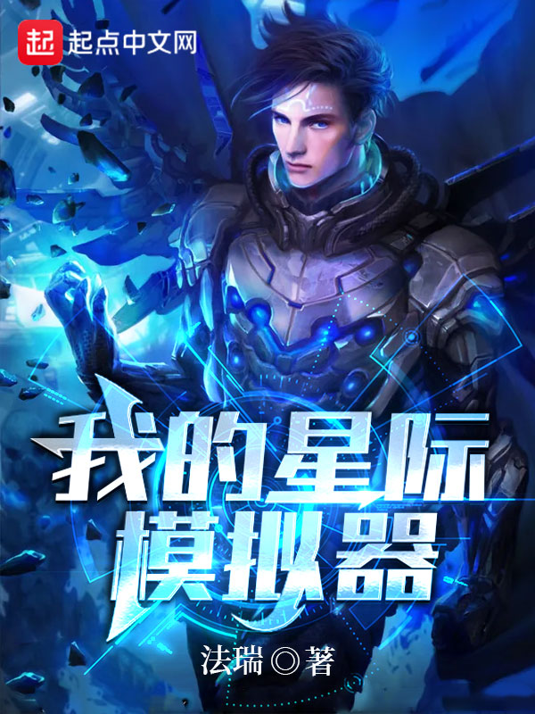

# 世界设定集

谢浩是一个边远矿区星球的零号元素矿工，通过一次挖掘获得了一件先行者遗物，激活了人生模拟器。花费一定金钱，可以进行一次人生模拟。

模拟结束后，可以选择异能者等级经验、特殊技能或者记忆碎片。

谢浩从此开启了异能者的人生模拟：

【你成为了一级异能者——苦痛者，但是由于你过度使用思维过载技能，大脑无力支撑，终于在二十八岁的时候精神崩溃，成为了异化魔。】

【你第一次踏入宇宙，就是一级异能者，成为了某个富人的随身异能者，一辈子都没离开过那个星球，最终成为二级异能者，死于异能污染。】

【你是一个二级异能者——迷幻者，你发现了异能者成为异化魔的规律，因此被异能管理局聘用，专门猎杀异化魔，然而在三十岁的时候，死于一次异化攻击。】

异能模拟、虫族入侵、先行者遗迹，这一切，谢浩都会在宇宙中揭开谜底！


[Broken link](broken-reference)



[Broken link](broken-reference)



[Broken link](broken-reference)



[Broken link](broken-reference)



[Broken link](broken-reference)

